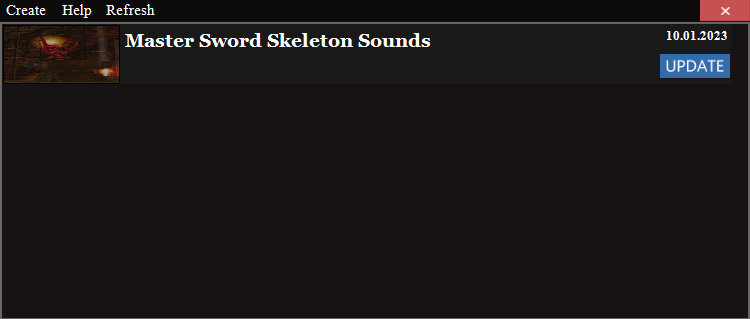
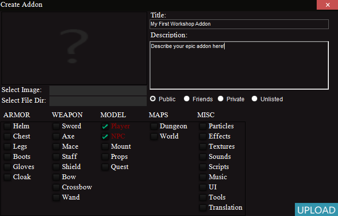
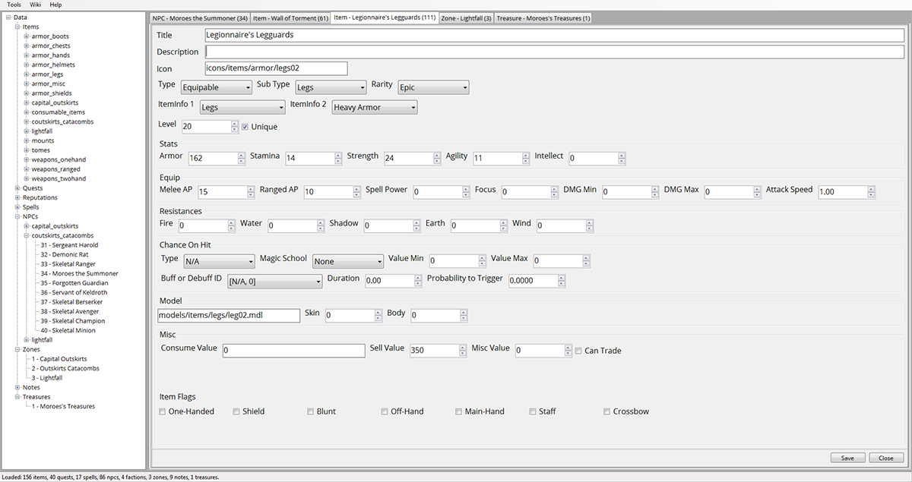
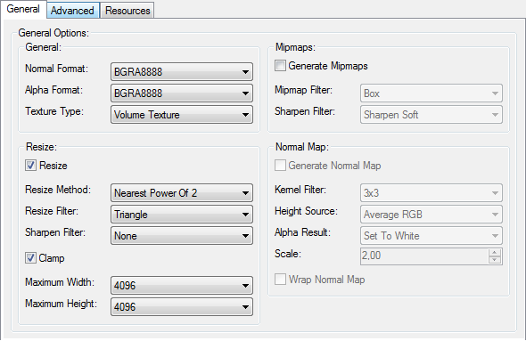
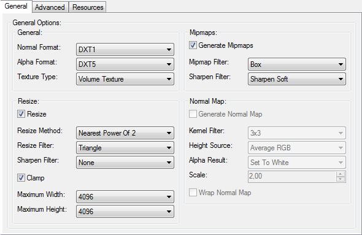
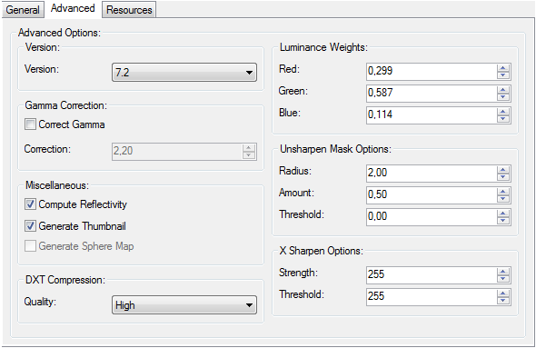
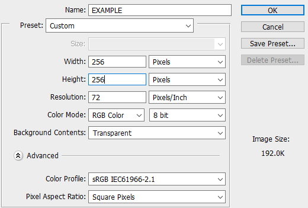

# Table of Contents
1. [Introduction](#introduction)
2. [Workshop](#workshop)
3. [Item Creator](#item-creator)
4. [Level Design](#level-design)
5. [3D Art](#3d-art)
6. [Animation](#animation)
7. [Scripting](#scripting)
8. [Server Hosting](#server-hosting)

# Introduction

This document will define a rough foundation for new developers, and modders who seek to contribute to Infestus!

### Some useful links
* [Maps](https://github.com/BerntA/SourceEngineMaps/tree/master/infestus)
* [Scripts & Localization](https://github.com/BerntA/InfestusScripting)
* [Trello Board](https://trello.com/b/WXSzasHk/infestus-roadmap)
* [Hammer++ for Infestus](https://drive.google.com/file/d/1SNWkgazqh3Sh1enKLRowtlqtctDgyGUZ/view)
* [Crowbar](https://github.com/ZeqMacaw/Crowbar/releases)
* [Wavosaur](https://www.wavosaur.com/download.php)
* [LAME MP3 Encoder](https://lame.sourceforge.io/)
* [Blender](https://www.blender.org/)
* [Blender Source Tools](https://developer.valvesoftware.com/wiki/Blender_Source_Tools)
* [VMT Generator](https://gamebanana.com/tools/6796)
* [VTF Edit](https://developer.valvesoftware.com/wiki/VTFEdit)
* [GCFScape](https://developer.valvesoftware.com/wiki/GCFScape)

# Workshop
We strongly encourage the community to contribute via [Steam Workshop](https://steamcommunity.com/app/656800/workshop/), it is a great way to share your creations with anyone who owns the game!
If you wish to upload a workshop addon, please ensure that:
* There are no memes
* No sexual content
* No exploits
* Maintains a decent fantasy medieval atmosphere!

### Uploader Tool
Infestus ships with a simple workshop uploader tool, launch it from *common/infestus/workshop/workshopper.exe*. Use this tool to create & upload your addons: select which tags it represents, give it some title & description, and finally select the respective content to upload.

**Disclaimer**: When you select the content to upload, ensure that the content is not packed into one or multiple VPK files, the tool will generate VPKs for supported files automatically!

#### View, Update & Create Addons


#### Creation Window


Lastly, remember to agree to the workshop [Steam Subscriber Agreement](https://steamcommunity.com/sharedfiles/workshoplegalagreement), otherwise you will not be able to upload/create a workshop addon!

# Item Creator

The Item Creator is a vital component for level designers, as this tool allows the creation of NPCs, spells, items, quests, factions, zones, etc.

It also has a wiki feature which exports all the data to a JSON file which can be loaded in a web client / browser (useful for documentation).



# Level Design

### Hammer Entities
* trigger_changelevel - Redirects the player who touches the volume to a new map or dungeon.
* func_player_blocker - A smart player clip which activates blocking based on whether or not the player has a certain item, reputation or quest. (with more adv. states)
* trigger_area_info - A volume which is used to tell the player if he is in a safe zone, pvp zone, no-mount zone, etc.
* info_graveyard_point - When a player dies he will be respawned at a nearby graveyard.
* info_start_point - A general start point.
* info_player_checkpoint - In dungeons you can have different checkpoints, so the spawns can change. This is useful if the dungeon is big and you do not want the players to waste too much time walking from the very start of the dungeon when they die. These checkpoints can also be secrets though.
* logic_entity_monitor - Will monitor if the given entity classname exists until those entities are removed. Can be used to track if a certain NPC ID is still alive, and fires output when they are all gone.
* logic_entity_counter - Count entity kills for a certain ent.
* logic_player_checker - Check if the player has a certain item, certain rep with a faction or if a quest is finished, started, or completed, etc.
* logic_quest_progress - Progress a certain objective (index 0-4) for a quest ID.
* logic_changelevel - Same as the trigger, but is activated by interacting with NPC dialogue or such.
* logic_bank_handler - Used to open the bank, normally an NPC static fires and output which triggers this entity. This entity is also triggered when bank access is purchased.
* logic_notification - Used to pop up misc notifications. Currently only used to pop up guild creation panel.
* logic_npc_dialogue - Print dialogue for some NPC in the chat. Can be sent to everyone regardless of PVS, or to a specific player.
* spell_object - Normally created through player or NPC spells, but can also be placed by a mapper. Check the spells in the Item Creator.
* item_object - Place a journal for lore, or some other item which can be picked up for quests.
* prop_dynamic_simple - A cheap dynamic prop with normally no collision, supports an idle anim and playing a gesture on top of this by activation.
* target_dummy - A target practice entity.
* npc_static - A static NPC, used for merchants, quest givers, interactables, bankers, etc. Any NPC which should not really move, attack, etc.
* npc_monster - A monster NPC, does not use weapons.
* npc_combatant - A combatant NPC, can use up to three weapons.
* vgui_screen_infosign - Can be used for road signs / street signs, shows the text in 3D space.
* func_soundscape - Infestus uses a much simpler soundscape logic, any player inside the volume will activate the soundscape. It is all fully client side though.
* func_soundscape_simple - Like above, but without sound position stuff. This is the most common choice, and is cheaper network wise.
* func_soundscape_area - Can be used to extend the reach of an existing func_soundscape.
* chest_object - A treasure chest, box, etc.
* game_chat - Write directly to the game chat.
* logic_stopwatch - Create a timed event, give unique rewards if the players manage to do what you want before the timer runs out.
* logic_bernoulli - Can be used to trigger rare events with a better RNG.
* env_night_cycle - Set Day Night Cycle in the map properties to override, use this entity to trigger on time based events, for example you may schedule an invasion event for 10pm.

Lots of legacy, and HL2 entities have been removed to make the game cheaper, simpler and to reduce the cost of networking. This enforces the use of the correct entities, the cheapest ones. All physics prop, and ragdoll stuff has also been removed.

### Worldspawn Properties
* Default Soundscape - Play this soundscape when the player is not within any func_soundscape volume.
* Map Type - Set to World or Dungeon.
* Day Skybox Texture.
* Night Skybox Texture.
* Day Night Cycle - Override implies that you have to put a env_night_cycle in the map, if set to automatic, a env_night_cycle will be inserted on map spawn at (0,0,0).

# 3D Art

### Armor
All armor should be fitted to the player perfectly, and will also require rigging. The only exception are helmets & cloaks, these need only be parented to the head bone or spine bone.

### Weapons
Weapons crafting does not require any special attention except for correct positioning in the grid. See previous weapon types for the right positioning. The positioning is important because they are relative to the attachment points they are moved and rotated to in-game.

### Players & NPCs
All players and combatant NPCs should have the correct attachment points, these points are used for positioning swords, axes, maces, shields, bows, etc.

* mainhand
* offhand
* offhand_shield
* back
* back_shield
* back_staff
* back_crossbow
* waist_l
* waist_r
* eyes - For all!

### Textures
Any 2D art should generally not have any compression, world textures, and model textures however should normally be DXT1 or DXT5. Keep the resolution around or under 1024x1024!

If you use specular and normal maps together, be sure to embed the specular in the normal maps alpha channel! See [normalmapalphaenvmapmask](https://developer.valvesoftware.com/wiki/$envmapmask).

#### VTF Edit Settings




#### Photoshop Texture Template


# Animation

See [Anim Blending](https://developer.valvesoftware.com/wiki/Blend_sequence) for how to setup proper movement cycles which changes based on the movement YAW. 
**Disclaimer**: Most of the anims here are gestures! Idle, movement, and most misc anims are non-gestures, and the names of the anims are arbitrary, the activities need to match however (ACT_...).

### Combatant NPCs
Since combatant NPCs use weapons they need more animations

#### Idle
* idle - ACT_IDLE
* idle_1h - ACT_IDLE_SWORD
* idle_2h_blunt - ACT_3PV_WARHAMMER_IDLE
* idle_2h_sharp - ACT_3PV_FLAMEBERGE_IDLE
* idle_ranged - ACT_3PV_aoc_LONGBOWIDLEUNDRAW

#### Draw & Holster
* holster_left - ACT_COMBATANT_HOLSTER_MELEE_1H_LEFT
* holster_right - ACT_COMBATANT_HOLSTER_MELEE_1H_RIGHT
* holster_2h_sharp - ACT_COMBATANT_HOLSTER_MELEE_2H
* holster_dual - ACT_COMBATANT_HOLSTER_MELEE_1H_BOTH
* holster_ranged - ACT_COMBATANT_HOLSTER_RANGED
* holster_shield_1 - ACT_COMBATANT_HOLSTER_MELEE_1H_BOTH_SHIELD
* holster_shield_2 - ACT_COMBATANT_HOLSTER_MELEE_1H_LEFT_SHIELD
* draw_left - ACT_COMBATANT_DRAW_MELEE_1H_LEFT
* draw_right - ACT_COMBATANT_DRAW_MELEE_1H_RIGHT
* draw_2h_sharp - ACT_COMBATANT_DRAW_MELEE_2H
* draw_dual - ACT_COMBATANT_DRAW_MELEE_1H_BOTH
* draw_ranged - ACT_COMBATANT_DRAW_RANGED
* draw_shield_1 - ACT_COMBATANT_DRAW_MELEE_1H_BOTH_SHIELD
* draw_shield_2 - ACT_COMBATANT_DRAW_MELEE_1H_LEFT_SHIELD

#### Attacking
* attack_1h_slash_l - ACT_INF_MELEE_1H_LEFT_SLASH (swing left arm)
* attack_1h_slash_r - ACT_INF_MELEE_1H_RIGHT_SLASH (swing right arm)
* attack_1h_spin - ACT_INF_MELEE_1H_SPIN ($360^{\circ}$)
* attack_1h_stab - ACT_3PV_SHORTSWORD_STAB
* attack_1h_shield_stab - ACT_3PV_SWORDSHIELD_STAB
* attack_1h_shield_slam - ACT_3PV_KITE_SLASH2
* attack_2h_blunt_slash - ACT_INF_MELEE_2H_BLUNT_SLASH \\ & ACT_3PV_WARHAMMER_SLASH1
* attack_2h_blunt_smash - ACT_3PV_WARHAMMER_SLASH2
* attack_2h_blunt_spin - ACT_INF_MELEE_2H_BLUNT_SPIN ($360^{\circ}$)
* attack_2h_blunt_stab - ACT_3PV_WARHAMMER_STAB
* attack_2h_sharp_slash - ACT_INF_MELEE_2H_SLASH
* attack_2h_sharp_smash - ACT_3PV_FLAMEBERGE_SLASH2
* attack_2h_sharp_spin - ACT_INF_MELEE_2H_SPIN ($360^{\circ}$)
* attack_2h_sharp_stab - ACT_3PV_FLAMEBERGE_STAB
* attack_ranged - ACT_3PV_aoc_LONGBOWSHOOT

#### Blocking (Optional)
* block_1h - ACT_3PV_SWORD_BLOCK
* block_shield - ACT_3PV_KITE_BLOCK
* block_2h_sharp - ACT_3PV_FLAMEBERGE_BLOCK
* block_2h_blunt - ACT_3PV_WARHAMMER_BLOCK

#### Special Attacks (Normally sufficient to reuse above attack anims and change the activity name!)
* attack_1h_stab - ACT_INF_MELEE_1H_RIGHT_STAB
* attack_1h_smash - ACT_INF_MELEE_1H_RIGHT_SMASH
* attack_2h_stab - ACT_INF_MELEE_2H_STAB
* attack_2h_smash - ACT_INF_MELEE_2H_SMASH
* attack_2h_blunt_stab - ACT_INF_MELEE_2H_BLUNT_STAB
* attack_2h_blunt_smash - ACT_INF_MELEE_2H_BLUNT_SMASH

#### Magic Spell Attack (Optional)
* cast_start - ACT_INF_MAGIC_CAST_START
* cast_idle - ACT_INF_MAGIC_CAST_IDLE
* cast_end - ACT_INF_MAGIC_CAST_END
* cast_instant_start - ACT_INF_MAGIC_CAST_INSTANT_START
* cast_instant_idle - ACT_INF_MAGIC_CAST_INSTANT_IDLE
* cast_instant_end - ACT_INF_MAGIC_CAST_INSTANT_END

#### Movement
* walk - ACT_WALK
* run - ACT_RUN
* Run while in combat - idle stance + move (Optional)    
	* run_1h - ACT_3PV_HL2MP_RUN_SHORTSWORD
    * run_1h_shield - ACT_3PV_HL2MP_RUN_SWORDSHIELD
    * run_2h_sharp - ACT_3PV_HL2MP_RUN_FLAMBERGE
    * run_2h_blunt - ACT_3PV_HL2MP_RUN_WARHAMMER
    * run_ranged - ACT_3PV_HL2MP_RUN_BOW_UNLOADED

#### Misc
* death - ACT_INF_DEATH
* death_idle - ACT_INF_DEATH_IDLE
* greeting - ACT_INF_GREETINGS
* merchant_idle - ACT_INF_NPC_IDLE
* work_mining - ACT_INF_WORK_MINING
* work_blacksmith - ACT_INF_WORK_BLACKSMITH
* knockdown (stun) - ACT_INF_KNOCKDOWN

### Monster NPCs
Monster NPCs do not have any weapons and can generally have something like

* Idle - ACT_IDLE
* Walk Cycle - ACT_WALK
* Run Cycle - ACT_RUN
* Death - ACT_INF_DEATH & ACT_INF_DEATH_IDLE
* General Attack - ACT_MELEE_ATTACK1
* Melee Spell Attack (OPTIONAL)    
    * ACT_INF_MELEE_STAB
    * ACT_INF_MELEE_SMASH
    * ACT_INF_MELEE_SLASH_RIGHT
    * ACT_INF_MELEE_SLASH_LEFT    
* Magic Spell Attack (OPTIONAL)    
    * ACT_INF_MAGIC_CAST_START
    * ACT_INF_MAGIC_CAST_IDLE
    * ACT_INF_MAGIC_CAST_END
    * ACT_INF_MAGIC_CAST_INSTANT_START
    * ACT_INF_MAGIC_CAST_INSTANT_IDLE
    * ACT_INF_MAGIC_CAST_INSTANT_END    
* Misc    
    * Knockdown - ACT_INF_KNOCKDOWN

### Players
Players are very similar to combatant NPCs, some difference is the naming of the activities. Some of the naming for the players are placeholder/temp names right now, so this section will be left out. The combatant structure will be used for the players in the future anyways! (check player01.mdl for an example)

### Mounts
Mounts only need a few anims
* Idle - ACT_INF_UNARMED_IDLE
* Jump - ACT_3PV_HL2MP_JUMP_SHORTSWORD
* Run Cycle - ACT_RUN

# Scripting

### Soundscapes
All soundscapes can be created in a similar fashion to stock HL2. The only additions include the support for randomized music and looping mp3 files.

#### Adding music to a soundscape
```python
"music"
{
	"music/forestwalk.mp3"
	{
		"volume" "0.3" # [0-1]
		"loop" "0" # If 1, will not fade out before playing again (fade-in afterwards)
	}
}
```

#### Looping an MP3 file for ambiance
```python
"playlooping"
{
	"wave"	"ambient/forest.mp3"
	"volume"	"0.70"
}
```

To properly loop mp3 files you might have to save the mp3 files in Wavosaur using the LAME mp3 encoder. From my experience, other encoders have not been able to save the file in a manner so that Source is able to extract the length of the file itself (this is not necessary for mp3 files in the music section, these are played using FMOD!).

### Game Soundscripts
This is also just like vanilla HL2.

#### NPCs

* Creature_*NPC*.Idle
* Creature_*NPC*.Pain
* Creature_*NPC*.Die
* Creature_*NPC*.Alert
* Creature_*NPC*.LostEnemy
* Creature_*NPC*.FoundEnemy
* Creature_*NPC*.EnemyDown
* Creature_*NPC*.AllyDown
* Creature_*NPC*.LeftCombat
* Creature_*NPC*.AnnounceAttack
* Creature_*NPC*.Taunt
* Creature_*NPC*.Flee
* Creature_*NPC*.Foley - Movement noise from equipment, if any
* Creature_*NPC*.Interact
* Creature_*NPC*.AttackHit
* Creature_*NPC*.AttackMiss
* Creature_*NPC*.Attack

**Example Voice Line Scripts**

* Flee	
	* Run for your lives!
	* I need help!
	* They're too strong!
	* NaaaaaH!	
* Taunt
  * I thought humans were smart!
  * Is that all you got?
  * Puny human, it takes more to challenge the likes of me!
  * *evil laugh*
* Alert
  * Incoming!
  * Stick'em up!
  * *shouting, brawl noise*	
* Interact
  * Yes?
  * Hello, traveler
  * What can I do for you?
  * Watch yourself, stranger
  * Get out of my face!
* LostEnemy 
  * Where did he go?
  * I'll have your heart next time!
  * Run away little piggie
* EnemyDown 
  * Weak, too weak...
  * This is too easy!
  * Another one!

#### Weapons
* WeaponMelee.Draw
* WeaponRanged.Draw
* WeaponMelee.Holster
* WeaponRanged.Holster
* WeaponMelee.Swing
* WeaponMelee.Smash
* WeaponMelee.Stab
* WeaponMelee.Miss
* WeaponMelee.Impact
* WeaponMelee.Block
* WeaponMelee.BlockShield
* WeaponRanged.ShootArrow
* WeaponRanged.ChargeArrow
* WeaponRanged.ReleaseArrow
* WeaponRanged.HitArrow

#### Magic
* Spell.FireBall.Start
* Spell.FireBall.End
* Spell.FireBall.Impact
* Spell.Frost.Start
* Spell.Frost.End
* Spell.Frost.Impact
* Spell.Arcane.Start
* Spell.Arcane.End
* Spell.Arcane.Impact

### Coding
The source code has not yet been published, more will be added here whenever stuff is more open source.

# Server Hosting
Please see this [Steam Thread](https://steamcommunity.com/app/656800/discussions/3/3767857092599397544/) for some insight!
